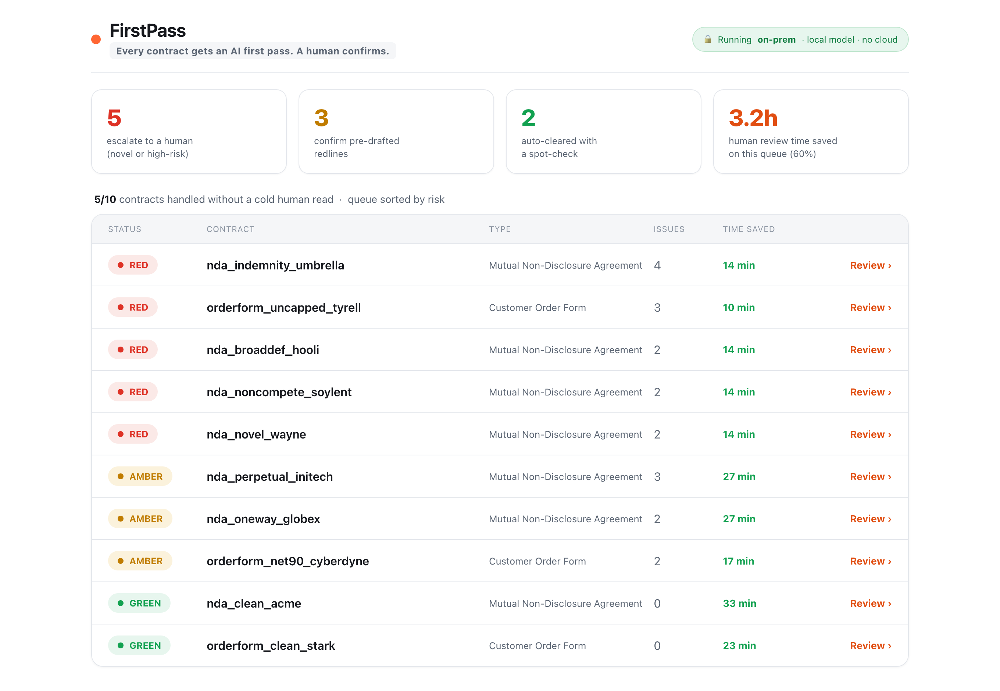
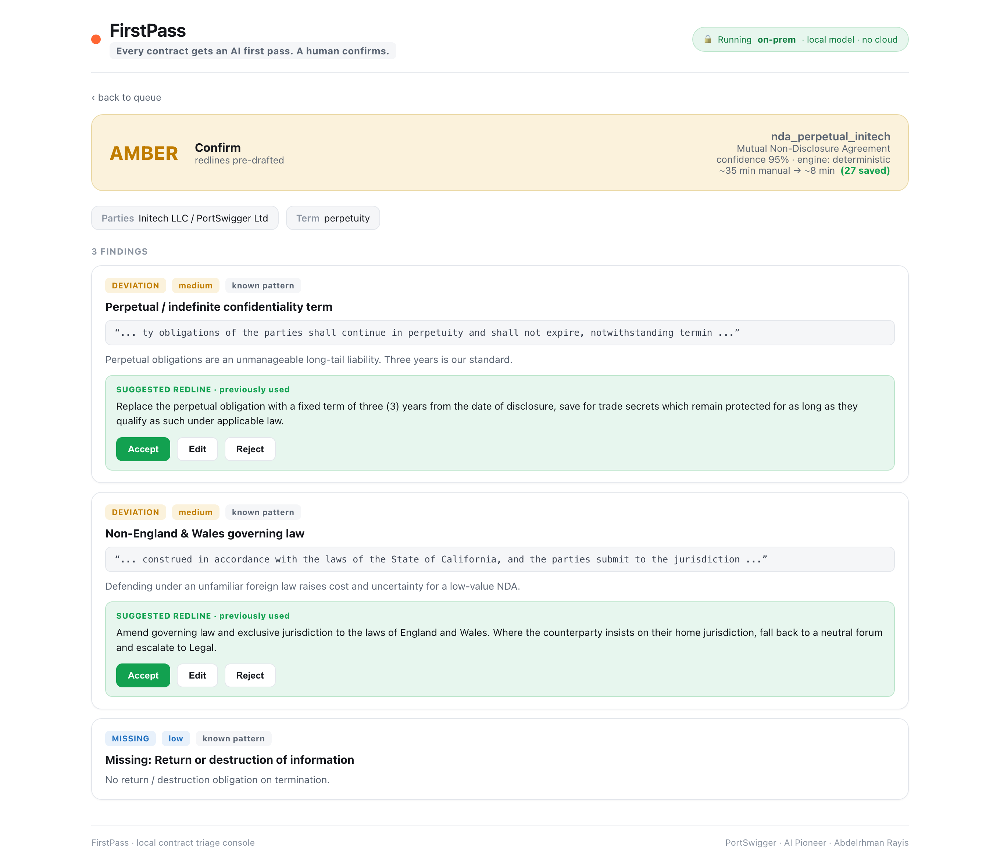

# FirstPass

**Every contract gets an AI first pass. A human confirms. The queue gets shorter every month.**

[](#setup)
[](LICENSE)
[](#private-by-design)

> **Quick links:** [Deck (PDF)](deck/FirstPass_PortSwigger.pdf) &middot; [Demo Video](https://github.com/Abdelrhman-Rayis/FirstPass/blob/main/videos/Video_Project.mp4) &middot; [Infographic](assets/AI_Contract_Triage_System.png)

An agentic first-pass reviewer for NDAs and customer order forms. It reads each
contract, checks it against a playbook of standard positions, and routes it:

- 🟢 **GREEN** — matches standard. Auto-clear with a spot-check.
- 🟡 **AMBER** — known deviations. Redline already drafted; lawyer confirms.
- 🔴 **RED** — novel or high-risk. Escalate for full human review.

 open source and happy for anyone to contribute to!

## Setup

```bash
python3 -m venv .venv && source .venv/bin/activate
pip install -r requirements.txt

python run.py --all                                  # triage the whole queue (CLI)
python run.py contracts/nda_perpetual_initech.txt    # one contract, full card
python evals/run_eval.py                             # measure it
python evals/demo_learning.py                        # watch the playbook learn
python webapp/app.py                                 # web console → http://localhost:5050
```

No API key, no network. The deterministic engine runs fully offline. Optional
local-model reasoning layer (`firstpass/llm.py`) talks to Ollama/vLLM on your server.

## Demo



*The web console. Contracts sorted by risk, the safe 80% cleared, redlines pre-drafted.*



*Inside a review. Key terms extracted, evidence shown, redline drafted. Accept, edit, or reject.*

## What it does

```
 AMBER  nda_perpetual_initech  (Mutual Non-Disclosure Agreement)
  route      : CONFIRM     (pre-drafted redlines ready)
  confidence : 95%
  1. [DEVIATION | medium | known] Perpetual / indefinite confidentiality term
     redline: Replace the perpetual obligation with a fixed term of three (3) years ...
  2. [DEVIATION | medium | known] Non-England & Wales governing law
     redline: Amend governing law to England and Wales ...
```

The lawyer confirms two redlines that are already written. That is the time saving.

## Evals

`python evals/run_eval.py`, deterministic engine, 10-contract set:

| Metric | Result |
|---|---|
| Unsafe misses (RED routed as non-RED) | **0** |
| Triage verdict accuracy | 100% (10/10) |
| Issue precision / recall | 93% / 93% |
| Review time saved | **58%** (~73 hours/month at 200 contracts) |

These are the floor (no LLM). The one recall miss is a paraphrased clause the
local-model layer catches. Numbers are reproducible. Full breakdown in
[`evals/results.md`](evals/results.md).

## The flywheel

When a lawyer resolves a RED, it becomes a playbook entry. Next time it is AMBER
with the redline pre-drafted. **Every human decision permanently shrinks the
future queue.** `python evals/demo_learning.py` closes the eval's one recall gap
with a single playbook edit — recall goes 93% → 100%.

## How it works

```
run.py ─► firstpass/triage.py   ingest → classify → retrieve → detect → score → draft → route → learn
            ├─ ingest.py        file → clauses (PDF/DOCX hooks)
            ├─ playbook.py      loads playbook/playbook.yaml (plain English, lawyer-editable)
            ├─ detect.py         deterministic red-flag / deviation / novelty layer
            ├─ llm.py            optional local model (Ollama/vLLM), no cloud
            ├─ risk.py           findings → GREEN/AMBER/RED + confidence
            ├─ report.py         lawyer-facing terminal card
            └─ learn.py          teach the playbook (the flywheel)
webapp/                         Flask console (dashboard + review view)
```

## Private by design

Runs on your server. The deterministic engine needs no model. The optional
reasoning layer is a local open-weight model (Llama 3.3, Qwen, Mistral). No
contract text ever leaves your infrastructure.

- Never signs, never sends — a human always decides
- Fails towards a human: anything novel or low-confidence goes RED
- Every finding cites the clause, evidence, and playbook rule

## Limitations

- Eval set is 10 synthetic contracts — a smoke test, not a benchmark
- Keyword engine misses paraphrases (that is the local-model layer's job)
- Two contract types modelled (NDA, order form); adding a type is playbook work
